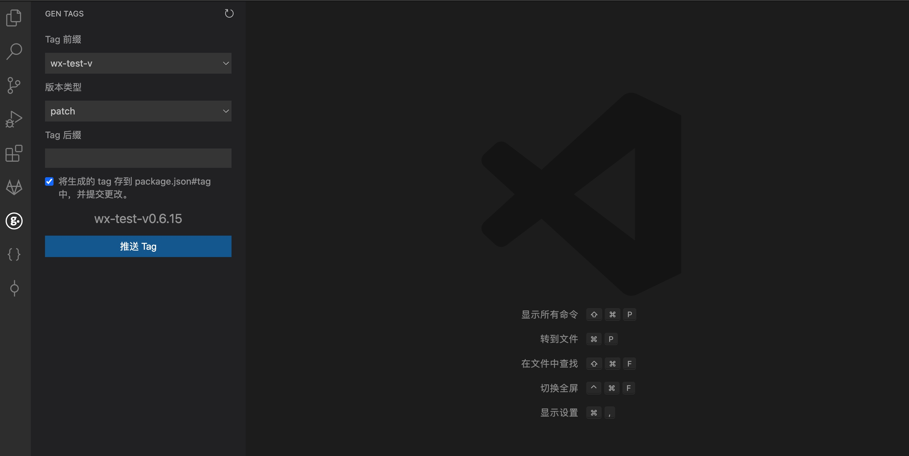

# Gen Tags

用于快速生成和推送 tag。

## Features

- 按规则生成 tag
- 支持前缀和后缀
- 同时修改 package.json 中的版本号

> 前缀通过 package.json 中的 `tagPrefix` 字段配置，如： `tagPrefix: ["v-"]`。

## Requirements

- vscode.git 扩展

## Known Issues

暂无

## Release Notes

### 1.0.0

Initial release of ...

## For more information

* [VSCode Marketplace](https://marketplace.visualstudio.com/items?itemName=zhaoqing.gen-tags)
