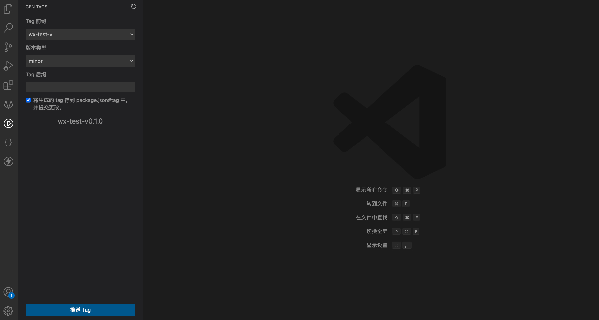

# gen-tags README

用于快速生成和推送 tag。

## Features

- 按规则生成 tag
- 支持前缀和后缀
- 同时修改 package.json 中的版本号

> 前缀通过 package.json 中的 `tagPrefix` 字段配置，如： `tagPrefix: ["v-"]`。

## Requirements

- vscode.git 扩展

## Known Issues

暂无

## Release Notes

### 1.0.0

Initial release of ...

## Following extension guidelines

Ensure that you've read through the extensions guidelines and follow the best practices for creating your extension.

* [Extension Guidelines](https://code.visualstudio.com/api/references/extension-guidelines)

## For more information

* [Visual Studio Code's Markdown Support](http://code.visualstudio.com/docs/languages/markdown)
* [Markdown Syntax Reference](https://help.github.com/articles/markdown-basics/)
